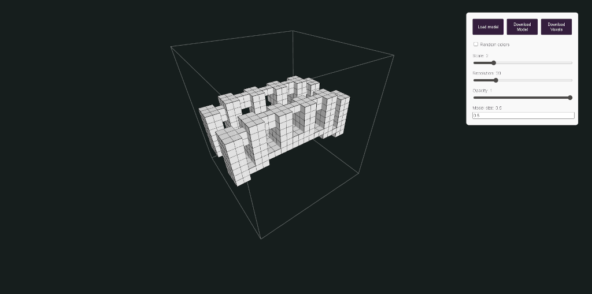

# voxelgen

Web application, generates voxels from the model. You can upload glb files, adjust the size of the voxels and other parameters. The result is saved in obj

[DEMO](https://voxelgen.reneos.com/)

